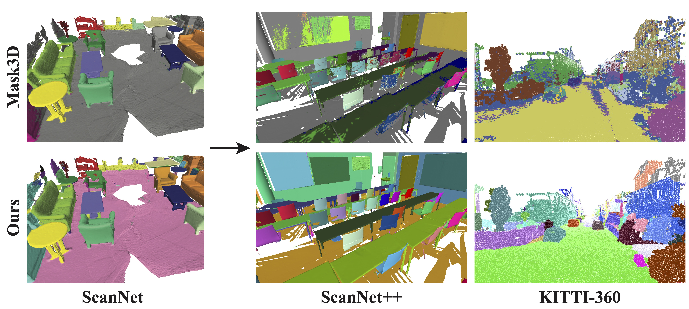
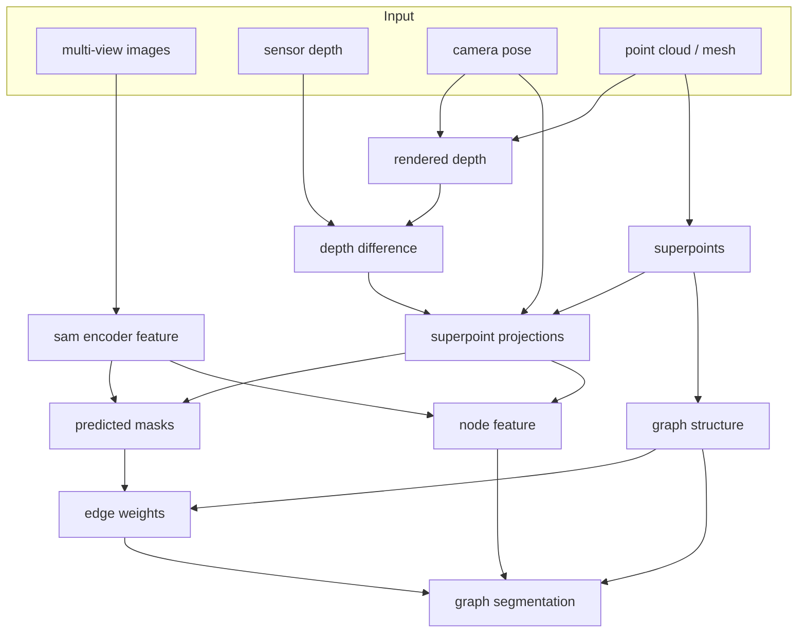

# SAM-guided Graph Cut for 3D Instance Segmentation
### [Project Page](https://zju3dv.github.io/sam_graph) | [Video](https://www.youtube.com/watch?v=daWiQiFPpZ0) | [Paper](https://arxiv.org/abs/2312.08372)

> [SAM-guided Graph Cut for 3D Instance Segmentation](https://arxiv.org/abs/2312.08372)  
> [Haoyu Guo](https://github.com/ghy0324)<sup>\*</sup>, [He Zhu](https://github.com/Ada4321)<sup>\*</sup>, [Sida Peng](https://pengsida.net), [Yuang Wang](https://github.com/angshine), [Yujun Shen](https://shenyujun.github.io/), [Ruizhen Hu](https://csse.szu.edu.cn/staff/ruizhenhu/), [Xiaowei Zhou](https://xzhou.me)
<br/>



<!-- ### Code is coming soon, please stay tuned! -->

## TODO

- [ ] Segmentation with / without GNN
- [x] Graph construction and SAM based annotation
- [ ] Processing of point clouds
- [x] Processing of triangle meshes


## Setup

The code is tested with Python 3.8 and PyTorch 1.12.0.

1. Clone the repository:
```
git clone https://github.com/zju3dv/SAM_Graph.git
```

2. Install dependencies:
```
   pip install -r requirements.txt
```
Clone ScanNet repository and build the [segmentor](https://github.com/ScanNet/ScanNet/tree/master/Segmentator) and modify `segmentor_path` in `scripts/run.py`.

Download the [checkpoint of segment-anything model](https://dl.fbaipublicfiles.com/segment_anything/sam_vit_h_4b8939.pth) and modify `sam_ckpt_path` in `scripts/run.py`.

## Data preparation

Please download the example data from [here](https://drive.google.com/file/d/1cvrs9Hd6TOUza7OV2bd9XhHAxpTG6q7m/view?usp=drive_link) and modify `data_path` in `scripts/run.py` for fast testing. If you want to use your own data, please organize the data as the same format as the example data.

## Run

The pipeline of our method is illustrated as follows:

<!--  -->



Note that `depth difference` step is optional, but is recommended if accurate sensor depth is available and the point cloud / mesh contains large holes or missing regions.

To run the pipeline, simply run:

```
cd scripts
python run.py
```

The results of each step will be saved in the individual folders.

## Citation

```bibtex
@inproceedings{guo2024sam,
  title={SAM-guided Graph Cut for 3D Instance Segmentation},
  author={Guo, Haoyu and Zhu, He and Peng, Sida and Wang, Yuang and Shen, Yujun and Hu, Ruizhen and Zhou, Xiaowei},
  booktitle={ECCV},
  year={2024}
}
```